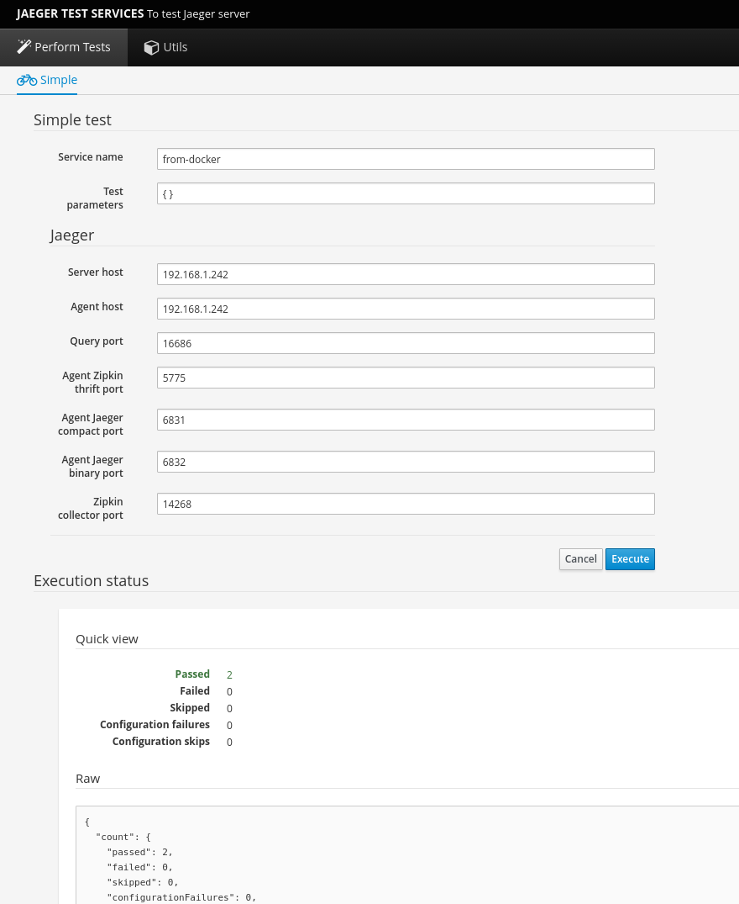

# Jaeger test server
[Jaeger](https://github.com/uber/jaeger) is a distributed tracing system by [Uber Technologies](http://uber.github.io/). We can run [Jaeger](https://github.com/uber/jaeger) on [Docker](https://www.docker.io), [OpenShift](https://openshift.io/) or in a standalone environment. When we go with Docker or OpenShift environment, we have to access Jaeger from the inside of the environment to run our tests. To run tests easier on any environment this project is born. We can use this project on any environment(standalone, docker, OpenShift) to run tests. This project is running on top of [Undertow](http://undertow.io/) web server. Test runs with the help of [TestNG](http://testng.org/doc/) testing framework.

#### Run this server on Docker continer
```bash
docker run -d -p 7000:7000 jkandasa/jaeger-test-server
```

#### Run this server on standalone machine
Download latest version from [releases page](https://github.com/Hawkular-QE/jaeger-test-server/releases).
```bash
$ tar xzf jaeger-test-server-*-single.tar.gz
$ cd jts
$ bin/start.sh
```
#### Run this server on OpenShift
```bash
oc process -f https://raw.githubusercontent.com/Hawkular-QE/jaeger-test-server/master/openshift-jaeger-test-server-template.yaml | oc create -f -
```
##### To delete from OpenShift
```bash
oc delete all -l app=jaeger-test-server
```

#### Execute test
To perform tests this server should be running either one of deployment option. We can run tests from UI as well as from REST API.

#### Run tests from UI
This server has it own UI to perform actions without additional tools.

About page shows details of this server.


Simple tests pages used to run simple tests on Jaeger server. We have to provide Jaeger server details and click on `Execute`. Once execution completed we can get the execution status as shown in this image.

We can pass any number of `Test parameters` as JSON format. These paramaters will be used on all the tests.



#### Run tests from REST API
Sometimes we may need to perform tests from maven or programetically. For this case we can use REST API calls.

##### Ping to test server:
GET https://localhost:7000/api/ping
Response: 200 OK
```json
{
  "hostname" : "jaeger-test-server-1-d1sj0",
  "timestamp" : 1497617332076
}
```
##### Run a test on Jaeger server
POST http://localhost:7000/api/tests/simple
```json
{
  "serviceName":"fromdocker",
  "config":{
    "serverHost": "localhost",
    "queryPort": 80,
    "agentHost": "localhost"
 }
}
```
**Note:** Here `serverHost` and `agentHost` are the Jaeger server/agent hostname or IP address.

Response: 200 OK
```json
{
  "count" : {
    "passed" : 2,
    "failed" : 0,
    "skipped" : 0,
    "configurationFailures" : 0,
    "configurationSkips" : 0
  },
  "configurationFailures" : [ ],
  "configurationSkips" : [ ],
  "passed" : [ {
    "method" : "singleSpanTest",
    "class" : "org.redhat.qe.jaeger.tests.SimpleSpanTest",
    "startMillis" : 1497616538331,
    "endMillis" : 1497616538845,
    "success" : true,
    "parameters" : [ ],
    "status" : 1
  }, {
    "method" : "spanWithChildTest",
    "class" : "org.redhat.qe.jaeger.tests.SimpleSpanTest",
    "startMillis" : 1497616538846,
    "endMillis" : 1497616539800,
    "success" : true,
    "parameters" : [ ],
    "status" : 1
  } ],
  "falied" : [ ],
  "skipped" : [ ]
}
```

### Where to add new tests?
All tests are performed with TessNG testing framework. We can add any number of tests on [Tests directory](src/main/java/org/redhat/qe/jaeger/tests).

### Create/compile package from source
```bash
$ git clone https://github.com/Hawkular-QE/jaeger-test-server
$ cd jaeger-test-server
$ mvn clean package
```

### Extra
#### To build, tag, push docker image
```bash
$ cd jaeger-test-server
$ mvn clean package
$ cd target
$ tar xzf jaeger-test-server-*-bundle.tar.gz
$ sudo docker build -t jaeger-test-server .
$ sudo docker tag jaeger-test-server jkandasa/jaeger-test-server:latest
$ sudo docker push jkandasa/jaeger-test-server:latest
```
